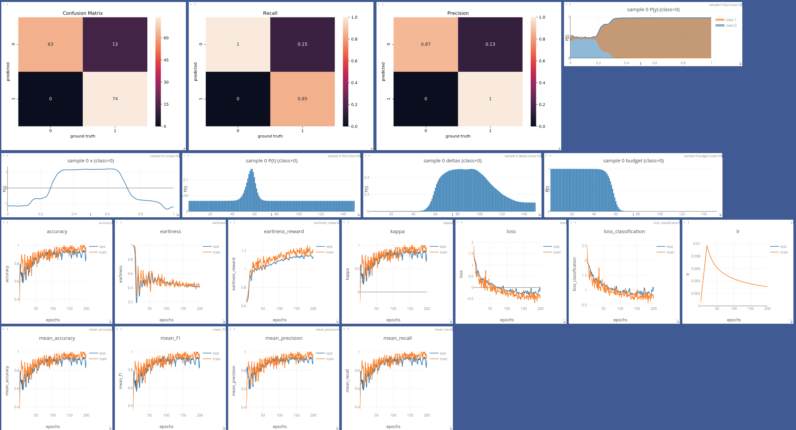
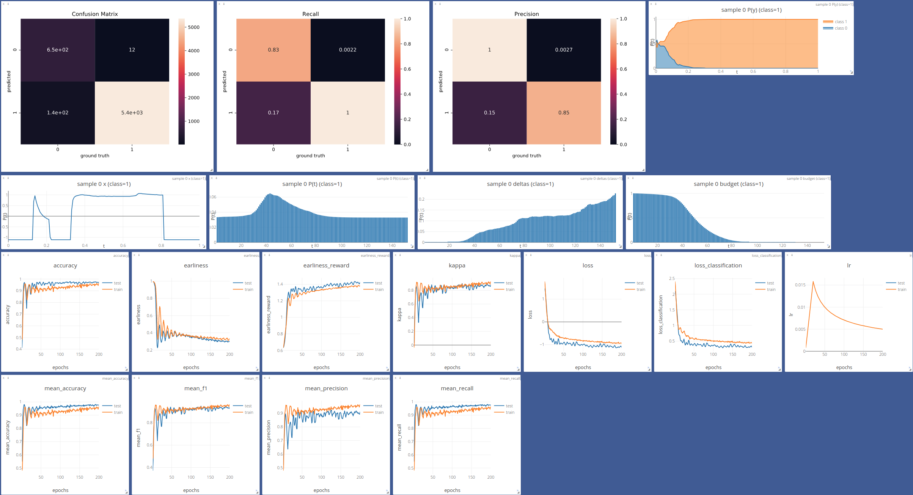
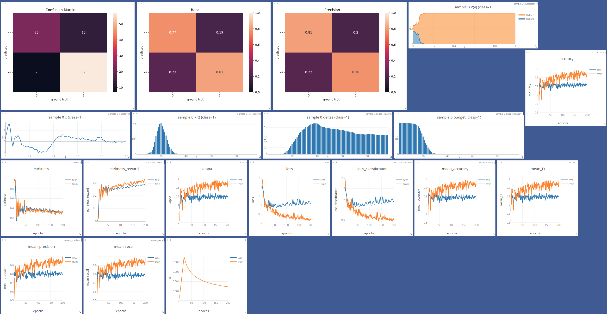
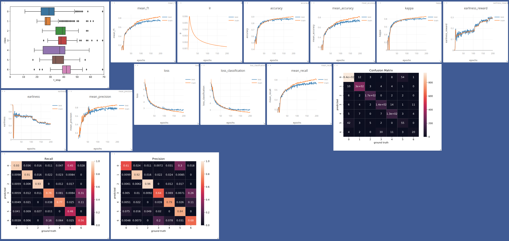

End-to-end Learning for Early Classification of Time Series (ELECTS)
===

**Note: This repository was used for explorative development of models and loss functions. For a more distilled and easier runnable version of the main RNN model and BavarianCrops dataset, check [https://github.com/marccoru/elects](https://github.com/marccoru/elects)**

Execute single run
```angular2
-d BavarianCrops -m DualOutputRNN --epsilon 10 --loss_mode early_reward -x test --earliness_reward_power 1 --train_on train --test_on valid -r 64 -n 4 -e 60 -s -1 -b 1024 --warmup-steps 100 --classmapping /home/marc/data/BavarianCrops/classmapping.csv.holl --dropout 0.5 -w 16 -i 1 -a .4 --store /tmp/test --overwrite
```


### Runs (visdom)

Gunpoint



Wafer



EGC



Remote Sensing Dataset




### Download data

```bash
wget https://s3.eu-central-1.amazonaws.com/corupublic/early_rnn.zip
```
